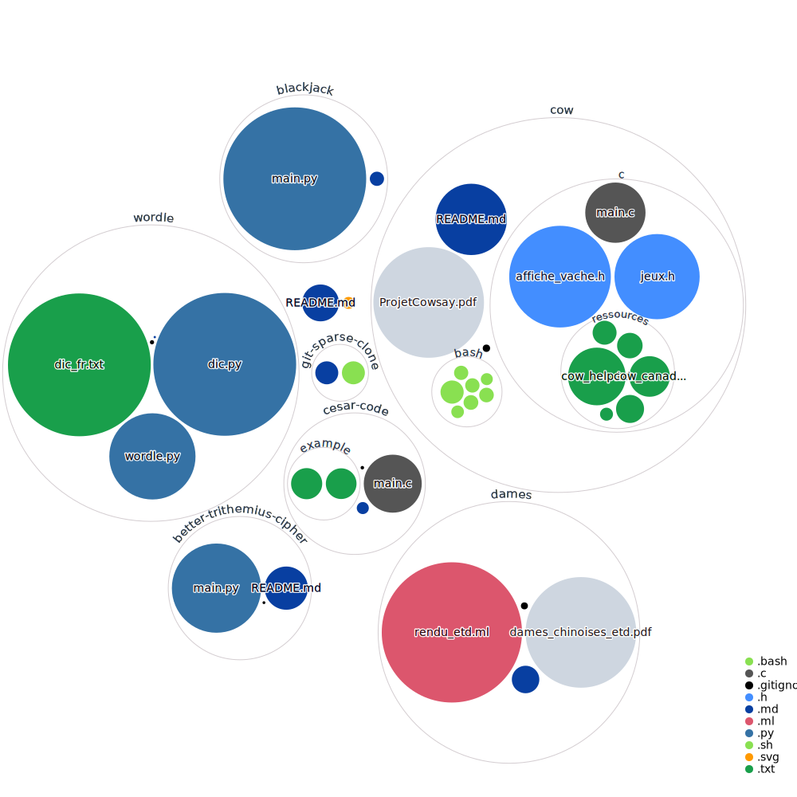

# utils-and-games
A collection of utilities and games that I wrote.

<kbd>

</kbd>

## Utilities
### [Sparse Cloning](sparse-clone_%5Bshell%5D_%5Bgit%5D) 
A script that allows you to clone a git repository without downloading all files and folders. This is useful if you only need a few files from a large repository.

### [Better Trithemius Cipher](better-trithemius-cipher_%5Bpy%5D) 
A python script that allows you to encrypt and decrypt a text using the Trithemius Cipher.

### [Cesar Code](cesar-code_%5BC%5D) 
A C program that allows you to automatically decrypt a text using the Cesar Code.

## Games
### [Blackjack](blackjack_%5Bpy%5D) 
A blackjack game written in python.

### [Cow](cow_%5BC%5D_%5Bshell%5D) 
A programm based on linux cowsay. It allows you to print a cow with a custom message and has a few options and games.

### [Dames](dames_%5BoCaml%5D) 
A game of dames written in oCaml.

### [Wordle](wordle_%5Bpy%5D) 
A wordle CLI game written in python.