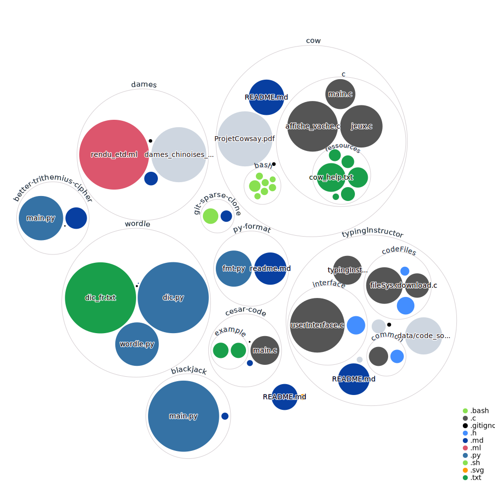

<p align="center">


</p>

# Utils and Games
A collection of utilities and games that I wrote.

<p align="center" href="https://raw.githubusercontent.com/comejv/utils-and-games/main/diagram.svg">
<kbd>

</kbd>
</p>

```
-------------------------------------------------------------------------------
Language                     files          blank        comment           code
-------------------------------------------------------------------------------
C                                9            205            118           1080
Python                           5             45             84            811
Markdown                        10             81              0            299
OCaml                            1             54            126            156
make                             3             59             15             89
C/C++ Header                     4             34             23             72
Shell                            8             13             16             69
-------------------------------------------------------------------------------
SUM:                            40            491            382           2576
-------------------------------------------------------------------------------
```

***

## Utilities
### [Sparse Cloning](git-sparse-clone) 
A script that allows you to clone a git repository without downloading all files and folders. This is useful if you only need a few files from a large repository.

### [Py Format](py-format) 
A python module that contains a few functions that allow you to format your output.
i.e. bold, italic, error, blinking, etc.

### [Better Trithemius Cipher](better-trithemius-cipher) 
A python script that allows you to encrypt and decrypt a text using the Trithemius Cipher.

### [Cesar Code](cesar-code) 
A C program that allows you to automatically decrypt a text using the Cesar Code.

***

## Games
### [Blackjack](blackjack) 
A blackjack game written in python.

### [Cow](cow) 
A programm based on linux cowsay. It allows you to print a cow with a custom message and has a few options and games.

### [Dames](dames) 
A game of dames written in oCaml.

### [Wordle](wordle) 
A wordle CLI game written in python.