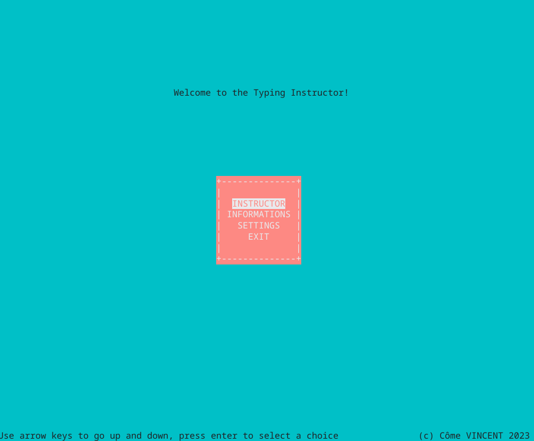

# Typing Instructor
## Description
> IMPORTANT : this is a work in progress and very not ready at all, this readme is what the goal is, not the current state

Typing Instructor is a command-line application designed to help programmers improve their typing skills by practicing with real-world code examples. The motivation behind this project was to create a more engaging and productive way for programmers to enhance their typing speed and accuracy while working with actual code snippets.

## Table of Contents
- [Typing Instructor](#typing-instructor)
  - [Description](#description)
  - [Table of Contents](#table-of-contents)
  - [Installation](#installation)
  - [Usage](#usage)
  - [Features](#features)
  - [How to Contribute](#how-to-contribute)
  - [Tests](#tests)
  - [Credits](#credits)
  - [License](#license)

## Installation
To install the project, follow these steps:

1. Clone the repository to your local machine.
2. Navigate to the project directory.
3. Run `make` command to compile the project.
4. An executable called `typingInstructor` will be generated in the project directory.

## Usage
To run the Typing Instructor, execute the following command in the terminal: `./typingInstructor`

The application supports the following command-line options:
- `-v`: Verbose output to stderr
- `-h`: Print the help message

For example, to run the application with verbose output: `./typingInstructor -v`

The main screen of the application allows you to choose between different options:
- **Instructor**: Start the typing practice session by choosing a language
- **Info**: Display information about the application and how to type faster
- **Settings**: Adjust application settings
- **Exit**: Quit the application

<kbd>

</kbd>

During the typing practice session, the application will display a code snippet for you to type. Your progress and speed will be shown at the bottom of the screen.

<kbd>

</kbd>

## Features
- Download code examples from specified URLs
- Practice typing with real-world code snippets
- Track typing progress during practice sessions
- Customize application settings

## How to Contribute
If you would like to contribute to the project, please follow these guidelines:
1. Fork the repository
2. Create a new branch for your feature or bugfix
3. Make your changes and commit them to your branch
4. Submit a pull request for review

## Tests
Currently, there are no tests available for the application. Contributions to create and document tests are highly appreciated.

## Credits
- [Curl](https://curl.haxx.se/) library for downloading code examples
- [ncurses](https://invisible-island.net/ncurses/) library for user interface

## License
This project is licensed under the [MIT License](https://choosealicense.com/licenses/mit/).

